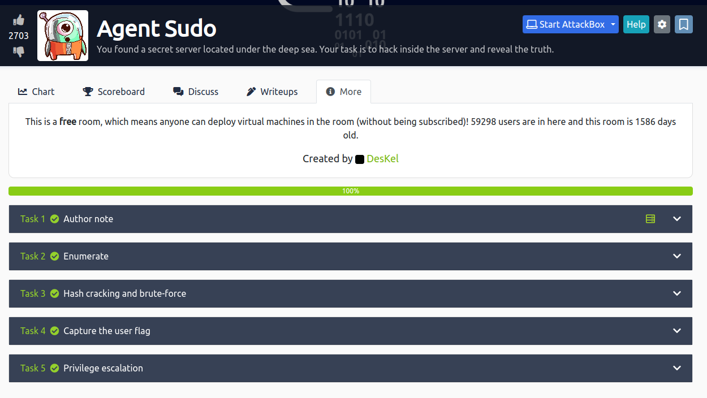

## 🚀 Agent Sudo Guide



### Task 1: Author's Note 📝
Welcome to this THM exclusive CTF room. Your mission, should you choose to accept it, involves capturing flags as you navigate through various challenges. Should you find yourself lost in a digital black hole, seek guidance in the forums or the TryHackMe Discord. Enjoy the adventure!

### Task 2: Enumerate 🔍
First things first, let's gather some intelligence on our target machine.

- **Open Ports**: Discover how many doors are open.
  
  ```bash
  nmap -sV -sC 10.10.29.30
  ```
  You'll find **3** open ports: **21** (FTP), **22** (SSH), and **80** (HTTP).

- **Secret Page**: Sneak into hidden directories using a tool like burpsuite or modify the User-Agent to impersonate an agent, hinting at using codenames like "R".

  ```http
  GET / HTTP/1.1
  Host: 10.10.29.30
  User-Agent: R
  ```

### Task 3: Cracking Codes and Forcing Entry 🔓
Now that we've scoped out the scene, let's break some barriers.

- **FTP Password**: Launch a brute force attack with hydra.
  
  ```bash
  hydra -l chris -P /usr/share/wordlists/rockyou.txt ftp://10.10.12.187:21
  ```
  The key to the FTP is `crystal`.

- **Zip File Password**: Uncover hidden messages within images using tools like binwalk and john the ripper.
  
  ```bash
  binwalk -e cutie.png
  ```
  Decrypt the zip to find it's guarded by an alien. 🛸

- **Steganography**: Extract secret communications with steghide.
  
  ```bash
  steghide extract -sf cute-alien.jpg -p Area51
  ```
  Unearth the full name of another agent involved in this mystery.

### Task 4: Flag Acquisition 🏁
The moment of truth, seizing the user flag and uncovering hidden stories.

- **User Flag**: Navigate through the user's directory.
  
  ```bash
  cat user_flag.txt
  ```
  A string of characters awaits your discovery.

- **Incident Analysis**: Employ your detective skills to deduce the event captured in an alien autopsy photo. (Hint: Try reverse image searching.)

### Task 5: Privilege Escalation ⬆️
Ascend to the highest echelons of access and claim your crown.

- **CVE Exploitation**: Utilize CVE-2019-14287 to elevate your privileges.
  
  ```bash
  sudo -u#-1 /bin/bash
  ```
  Root around to find the root flag and perhaps uncover the true identity of Agent R.